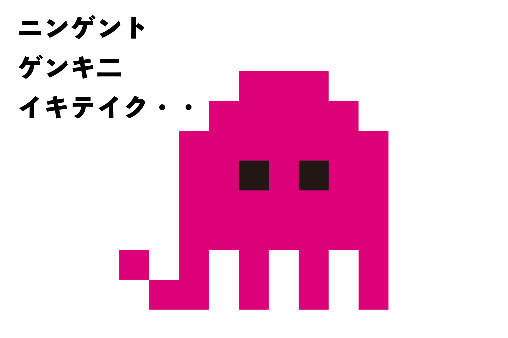

# COPYPET！

「通称、こぴぺっ！」

## このペットはあなたの「食事」や「運動」「睡眠時間」をそのままコピーして生活します。

あなたの健康状態のコピーペットです。

バランスの取れた食事・栄養。
充実した睡眠時間や適度な運動を行えば健康なペットとして育つはず！

# このAPI作成にあたっての経緯

Javaを学習中に簡単なAPIを作成したが、もっとおおきなプロジェクトに挑戦したかった。

自分が栄養知識やダイエットなどに関心がありそういうアプリを試したことはあったが

ゲーム感覚で記録できるAPPがなかったので作成に至った。
