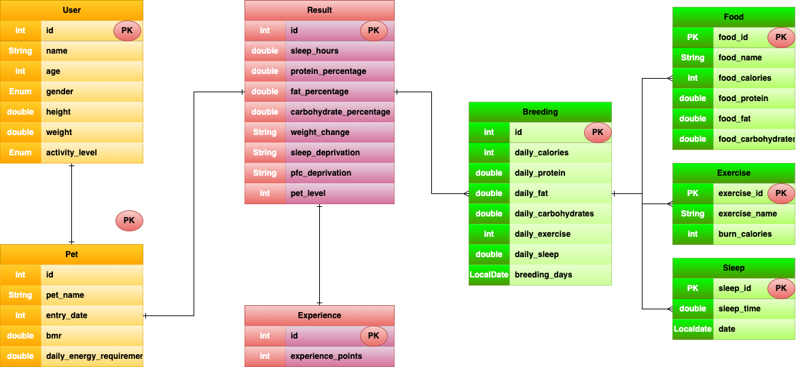

# COPYPET！

「通称、こぴぺっ！」

## このペットはあなたの「食事」や「運動」「睡眠時間」をそのままコピーして生活します。

あなたの健康状態のコピーペットです。

バランスの取れた食事・栄養。
充実した睡眠時間や適度な運動を行えば健康なペットとして育つはず！

# 概要

このAPIは、ユーザーがペットを登録し、そのペットに対して食事や運動、睡眠時間を記録することができるAPIです。

ユーザーとペットは１対１の関係であり、ユーザーがペットを登録することでペットが作成されます。

登録が完了したらペットはユーザーの身長・体重・年齢を元に、基礎代謝・アクティブレベルを計算し、健康の基準を設定します。

育成データはいつ、何を食べたか、何を運動したか、何時間寝たかを確認できます。
また、あらかじめ登録してある食事名や運動名を呼び出し登録することも可能です。

# このAPI作成にあたっての経緯

Javaを学習中に簡単なAPIを作成したが、もっとおおきなプロジェクトに挑戦したかった。
自分が栄養知識やダイエットなどに関心がありそういうアプリを試したことはあったが
ゲーム感覚で記録できるAPPがなかったので作成に至った。

# 参考文献

## 基礎代謝について

ハリス・ベネディクト方程式(改良版)を採用

日本人向けのハリス・ベネディクト方程式(改良版)は以下の通りです。

- 男性：13.397×体重kg+4.799×身長cm-5.677×年齢+88.362
- 女性：9.247×体重kg+3.098×身長cm-4.330×年齢+447.593

参考：
[Ke!san](https://keisan.casio.jp/exec/system/1161228736)

## アクティブレベルについて

### LOW, MEDIUM, HIGHの３つのレベルに分けています。

__LOW__ 生活の大部分が座位で、静的な活動が中心の場合

__MEDIUM__ 座位中心だが、職場内での移動や立位での作業・接客等、通勤・買物・家事、軽いスポーツ等のいずれかを含む場合

__HIGH__ 移動や立位の多い仕事への従事者。あるいは、スポーツなど余暇における活発な運動習慣をもっている場合

| activityLevel | rate |
|---------------|------|
| 1             | 1.5  |
| 2             | 1.75 |
| 3             | 2.0  |

# ER図

# API一覧

| Method |    Path    |         API         |
|:------:|:----------:|:-------------------:|
|  POST  |   /users   |    ユーザーを新規登録します     |
|  POST  | /pets/{id} | ユーザーに紐づけてペットを登録します。 |

 

